# Crypto Market Analytics Platform

A distributed real-time cryptocurrency market data platform built as a microservices system. The platform ingests live trade and quote data from BitMEX (or a built-in synthetic generator for offline demos), processes it through a set of streaming jobs, persists results into Cassandra and PostgreSQL, and exposes everything through a secured API gateway consumed by a browser-based dashboard.

---

## Team

| # | Name | Responsibility |
|---|---|---|
| Person 1 | Yuliana Hrynda | API Gateway — routing, token validation, gateway tests |
| Person 2 | Roman Pavlosiuk | Auth Service — register/login/logout, Redis sessions, two instances, failover |
| Person 3 | Iryna Denysova | Market Data Service — Cassandra repository, trades/momentum/alerts endpoints, replication |
| Person 4 | Andrii Kravchuk | Reporting Service — PostgreSQL warehouse, batch jobs, hourly reports, analytics |
| Person 5 | Khrystyna Korets | Ingestion, streaming jobs, synthetic data producer, frontend dashboard, smoke tests |

---

## System Architecture

The platform is split into five logical layers: data ingestion, stream processing, storage, API services, and the frontend client. Each layer is independently deployable and communicates only through well-defined interfaces — either Kafka topics or HTTP.

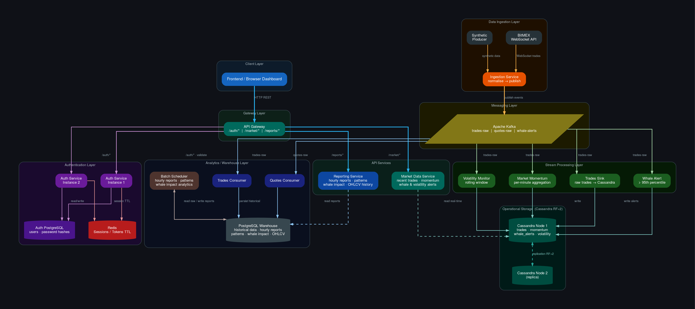

### Data Ingestion Layer

All market data enters the system through the **Ingestion Service**. In live mode it opens a persistent WebSocket connection to the BitMEX public API and subscribes to `trade` and `quote` channels for the configured symbols (XBTUSD and ETHUSD by default). Each incoming message is normalised into a flat JSON payload and published to one of two Kafka topics: `trades-raw` or `quotes-raw`. The service handles reconnection automatically with exponential backoff, so transient network issues do not cause data loss.

For development and demo purposes the same service supports a **Synthetic Mode** (`SYNTHETIC_MODE=true`). In this mode the WebSocket is bypassed entirely and the service generates realistic random-walk trade data internally at a configurable rate. Prices drift stochastically ±0.05% per tick, and a configurable fraction of trades are marked as whale-sized. The payload schema is identical to live data, so all downstream consumers work without any changes. This makes it possible to fully demonstrate the system without any external dependencies or internet access.

### Message Broker

**Apache Kafka** (KRaft mode, no ZooKeeper) is the backbone of the streaming architecture. All producers publish with `acks=all` and idempotence enabled, which prevents duplicate messages in the event of retries. Topics are created automatically with three partitions. Kafka decouples the ingestion service from all consumers: if a streaming job restarts it simply resumes from its last committed offset, and new consumer groups can be added without touching the producer.

### Stream Processing Layer

Four independent streaming jobs consume the `trades-raw` topic concurrently, each in its own consumer group so they all receive every message independently.

**Trades Sink** is the simplest job: it reads each trade and writes it directly to the Cassandra `trades` table. This provides a low-latency operational mirror of recent trades that the Market Data Service queries for the live feed endpoint.

**Whale Alert** maintains a per-symbol sliding window of trade sizes over the last 10 minutes. For every new trade it recomputes the 95th-percentile size threshold across the window. If the incoming trade exceeds that threshold the job emits an alert to the `whale-alerts` Kafka topic and persists it to Cassandra. To avoid premature alerts during startup, it requires at least 30 samples in the window before firing. The deviation percentage — how far above the threshold the trade was — is stored alongside the alert.

**Volatility Monitor** tracks price series in a 10-minute sliding window per symbol and splits it at the midpoint into a "current" half (last 5 minutes) and a "previous" half (5–10 minutes ago). After each trade it computes the standard deviation of prices in each half. When the current half's std-dev exceeds the previous half's by more than 2×, a volatility alert is emitted. A 60-second cooldown per symbol prevents alert flooding during sustained volatile periods.

**Market Momentum** aggregates trades into per-minute OHLCV-style buckets. For each closed minute it writes one row to Cassandra containing the last price, percentage change from the previous minute's close, total USD volume, and the buy/sell volume ratio. A background thread flushes buckets periodically so momentum data continues flowing even during quiet market periods.

### Storage Layer

The platform uses two databases with different roles.

**Cassandra** (two-node cluster) stores all operational real-time data: raw trades, momentum bars, whale alerts, and volatility alerts. Cassandra is chosen here because the access pattern is almost exclusively append-and-range-scan by `(symbol, date/time)`, which maps naturally to its partition-key + clustering-column model. The two-node setup with GossipingPropertyFileSnitch provides basic fault tolerance: if one node goes down, reads and writes continue against the surviving node.

**PostgreSQL** (two separate instances) is used for two different purposes. The analytics warehouse instance stores the raw trades and quotes written by the warehouse consumers, as well as all batch-aggregated reports. The auth database instance stores user records with PBKDF2-SHA256 password hashes; it is intentionally isolated so a compromise of the analytics database has no impact on authentication.

**Redis** stores active user sessions as hash keys with a TTL. Because both Auth Service instances connect to the same Redis, a session created on instance 1 is immediately valid on instance 2, enabling stateless horizontal scaling of the auth tier.

### Warehouse Consumers and Batch Jobs

In parallel with the streaming jobs, two separate Kafka consumer groups — **Trades Consumer** and **Quotes Consumer** — read the same topics and write to PostgreSQL. This gives the analytics warehouse a complete historical record that the streaming Cassandra tables, which store only a rolling window of recent data, do not provide.

The **Batch Scheduler** runs three periodic jobs against the PostgreSQL warehouse. The hourly report job aggregates raw trades into per-hour summaries with open/high/low/close prices, total volume, buy and sell volume split, and the dominant side. The trading patterns job builds hour-of-day profiles showing average activity and volatility for each hour, which reveals intraday seasonality. The large trades job computes P90 size thresholds and measures the average price impact of large trades in each direction.

### API Services Layer

Three internal FastAPI services expose the stored data over HTTP. None of them are reachable directly from outside Docker — all external traffic must pass through the API Gateway.

The **Market Data Service** queries Cassandra exclusively. It has a thin repository layer that handles connection retries at startup and executes parameterised CQL queries. Endpoints accept filters (symbol, date range, size threshold, side) and a configurable limit, making it easy to query exactly the data the frontend needs without over-fetching.

The **Reporting Service** queries PostgreSQL exclusively. It exposes the batch-aggregated hourly reports, trading pattern profiles, whale impact analysis, and raw OHLCV price history. Endpoints validate parameters strictly and return structured Pydantic models.

The **Auth Service** runs as two identical instances. It handles user registration, login, logout, and session validation. On login it generates a cryptographically random opaque token, stores it in Redis with a 24-hour TTL, and returns it to the client. The `/auth/validate` endpoint is called by the gateway on every protected request — it checks the Redis key and returns the associated user payload if the session is still active.

### API Gateway

The **API Gateway** is the single public-facing entry point for all client traffic. It routes incoming requests by path prefix: `/auth/*` goes to the Auth Service (round-robin across both instances), `/market/*` goes to the Market Data Service, and `/reports/*` goes to the Reporting Service. Before forwarding any request to a protected route, the gateway calls `/auth/validate` on an auth instance. If the token is missing, malformed, or expired the gateway returns 401 immediately without touching the downstream service. If all instances of a given upstream are unreachable it returns 502. The gateway also adds CORS headers so the browser-based frontend can make cross-origin requests.

### Frontend

The **Frontend** is a single-page application served by nginx. It is written in plain HTML, CSS, and JavaScript with no framework or build step. On load it presents a login/register form. After authentication the dashboard appears, showing five live-updating panels: Recent Trades, Market Momentum, Whale Alerts, Volatility Alerts, and Hourly Reports. A symbol selector in the top bar switches all panels between XBTUSD and ETHUSD simultaneously. All panels auto-refresh every 15 seconds and each has a manual refresh button. Signing out calls `POST /auth/logout` through the gateway, which deletes the Redis session key server-side before clearing the token from the browser.

---

## Quick Start

```bash
# Start with synthetic data (no BitMEX connection needed)
SYNTHETIC_MODE=true docker compose up -d

# Open the dashboard
open http://localhost:3000

# Run API smoke tests
bash tests/api_smoke_test.sh

# Run full infrastructure smoke test
bash tests/smoke.sh
```

For live BitMEX data:
```bash
docker compose up -d
```

To run the synthetic producer as a separate service alongside live ingestion:
```bash
docker compose --profile demo up -d
```

---

## Port Reference

| Port | Service |
|---|---|
| 3000 | Frontend (nginx) |
| 8080 | API Gateway |
| 8100 | Market Data Service |
| 8101 | Auth Service instance 1 |
| 8102 | Auth Service instance 2 |
| 8200 | Reporting Service |
| 9092 | Kafka |
| 9042 | Cassandra node 1 |
| 9043 | Cassandra node 2 |
| 5432 | PostgreSQL warehouse |
| 5433 | PostgreSQL auth |
| 6379 | Redis |

---

## API Gateway Routes

All requests go to `http://localhost:8080`.

| Method | Path | Auth required | Description |
|---|---|---|---|
| POST | `/auth/register` | No | Create account |
| POST | `/auth/login` | No | Get Bearer token |
| POST | `/auth/logout` | Yes | Invalidate session |
| GET | `/auth/me` | Yes | Current user info |
| POST | `/auth/validate` | Yes | Validate token |
| GET | `/market/trades` | Yes | Recent trades |
| GET | `/market/momentum/{symbol}` | Yes | Per-minute momentum |
| GET | `/market/alerts/whale/{symbol}` | Yes | Whale trade alerts |
| GET | `/market/alerts/volatility/{symbol}` | Yes | Volatility alerts |
| GET | `/reports/hourly` | Yes | Hourly OHLCV report |
| GET | `/analytics/trading-patterns` | Yes | Hour-of-day patterns |
| GET | `/analytics/whale-impact` | Yes | Large trade impact |
| GET | `/price/{symbol}` | Yes | OHLCV price bars |

---

## Project Structure

```
apz_project/
├── api-gateway/          # Public entry point, token validation, routing
├── auth-service/         # Register / login / logout / session validation
├── market-data-service/  # Cassandra-backed market data API
├── reporting-service/    # PostgreSQL-backed analytics API
├── ingestion/            # BitMEX WS ingestion + synthetic data mode
├── streaming/            # Kafka→Cassandra streaming jobs (4 services)
├── consumer/             # Kafka→PostgreSQL warehouse consumers
├── batch/                # Scheduled batch aggregation jobs
├── frontend/             # nginx-served SPA (vanilla JS)
├── ddl/
│   ├── cassandra/        # Cassandra keyspace + table DDL
│   └── warehouse/        # PostgreSQL warehouse schema
├── tests/
│   ├── smoke.sh          # Full infrastructure smoke test
│   ├── api_smoke_test.sh # Gateway API test (auth + market + reports)
│   ├── gateway_test.sh   # Gateway-specific tests
│   ├── synthetic_producer.py  # Standalone Kafka trade generator
│   └── ...
└── docker-compose.yml
```

---

## Screenshots

### All services running

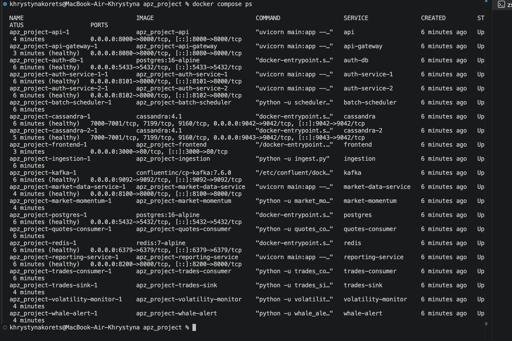

### Sign in

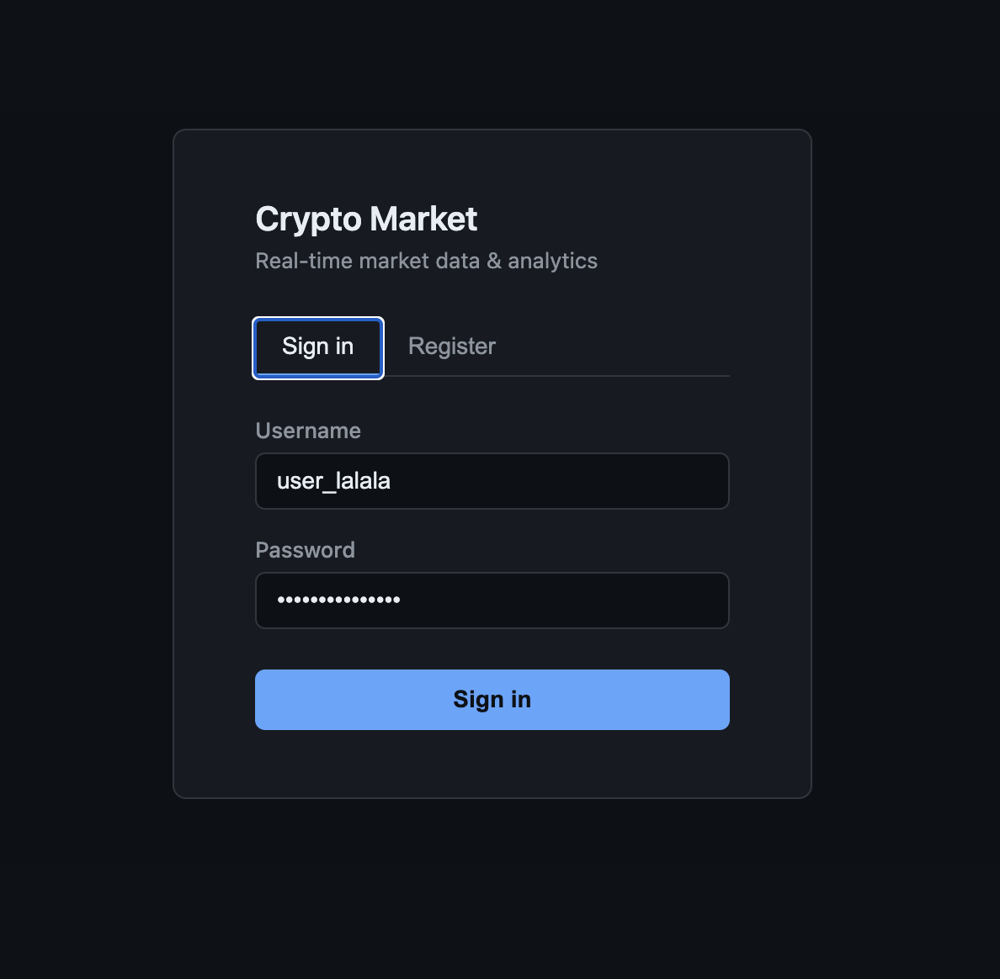

### Register

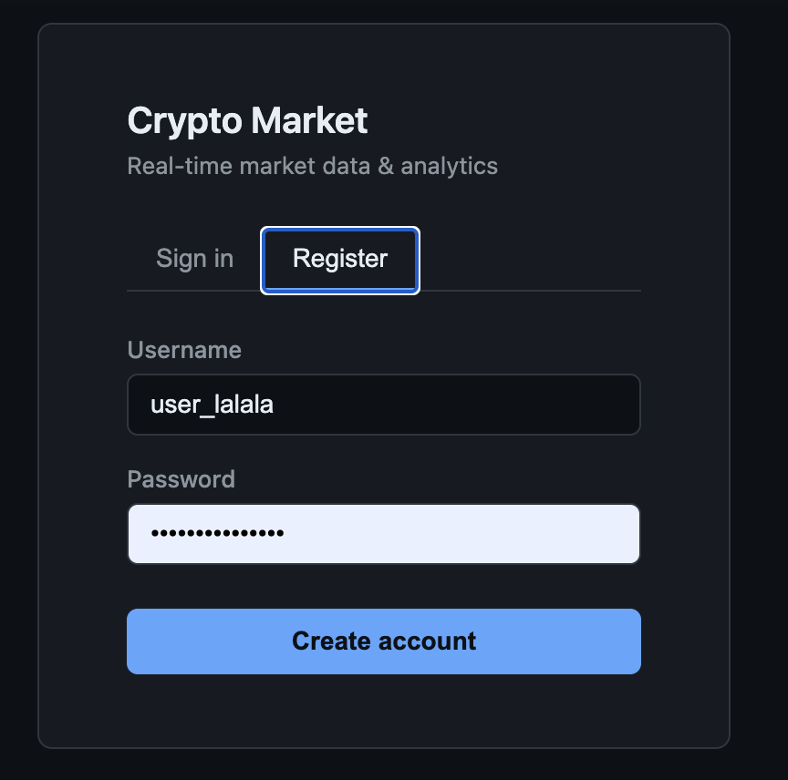

### Recent Trades

Live trade feed from Cassandra, auto-refreshing every 15 seconds.

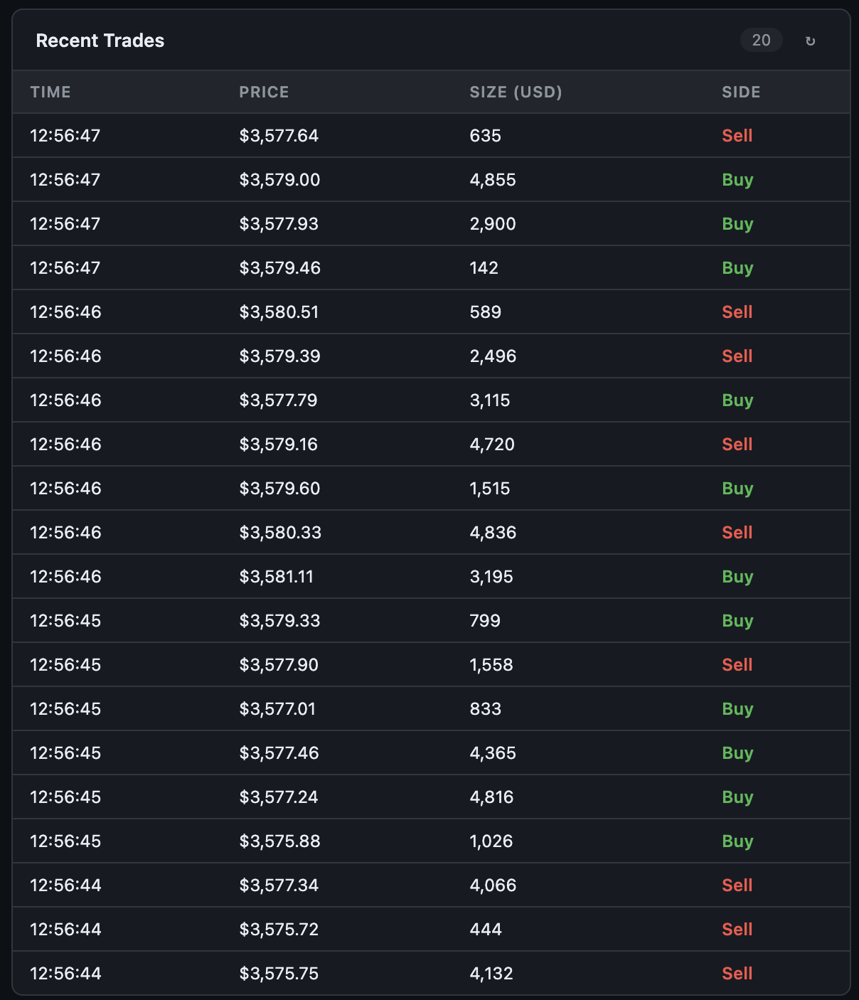

### Market Momentum

Per-minute aggregated price change, volume, and buy/sell ratio.

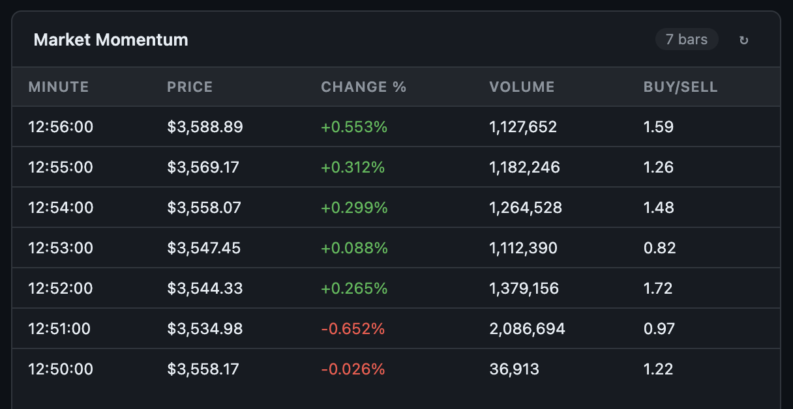

### Whale Alerts

Trades exceeding the 95th-percentile size threshold in the 10-minute sliding window.

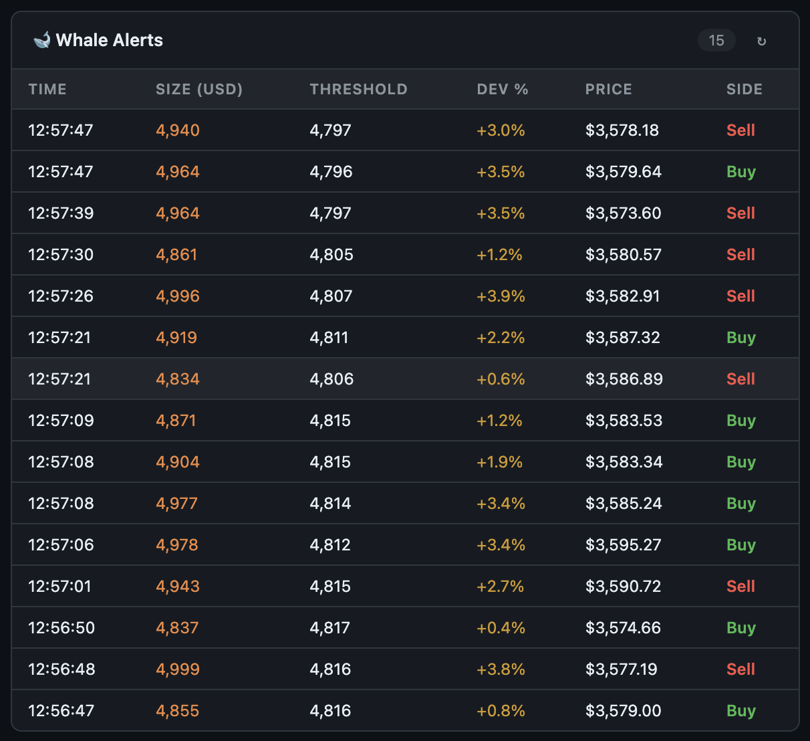

### Volatility Alerts

Fired when current 5-minute price std-dev exceeds the previous 5-minute window by 2×.

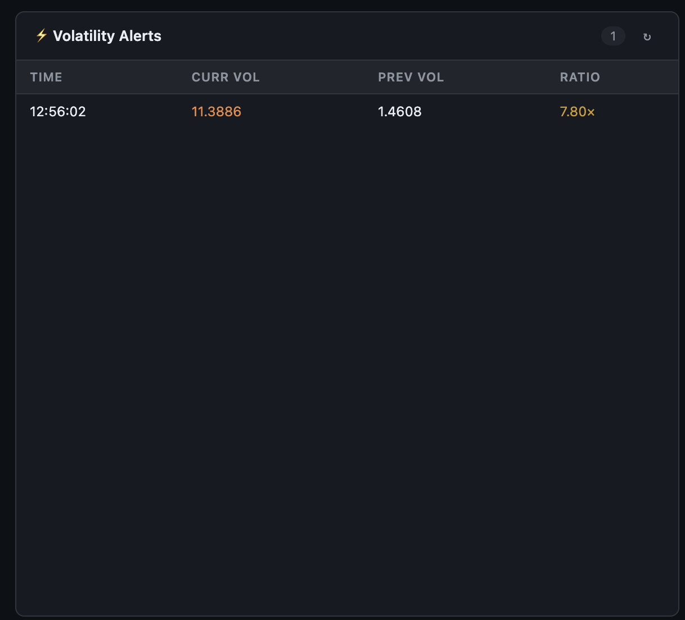

### Hourly Reports

Batch-aggregated OHLCV + buy/sell volume breakdown per hour.

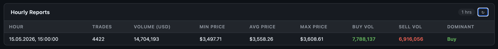

### Sign out

Session invalidated server-side; token rejected on subsequent requests.

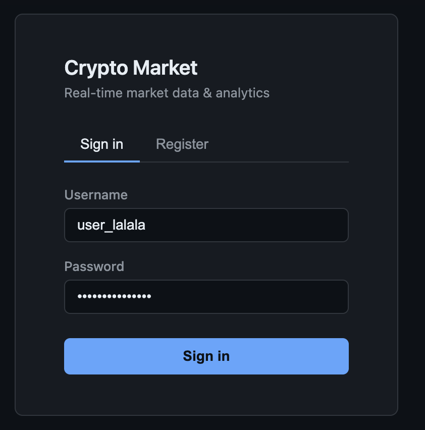

### API Smoke Test — 24/24 passing

Full end-to-end test through the API gateway: auth flow, all market endpoints, all report endpoints, logout invalidation, frontend reachability.

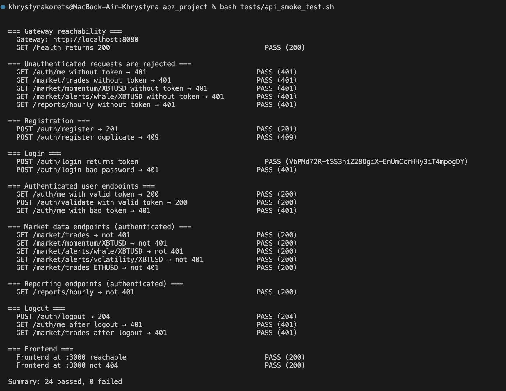
